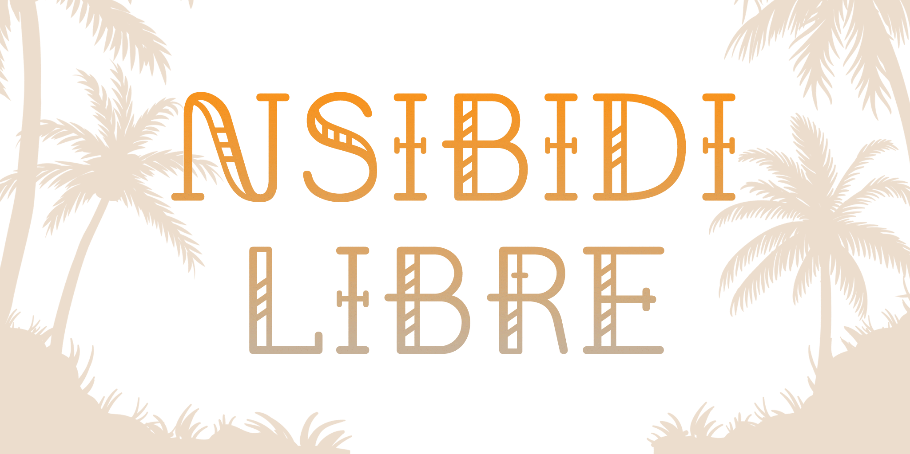

# Nsibidi Libre

[![][Fontbakery]](https://theseunbadejo.github.io/nsibidi-libre/fontbakery/fontbakery-report.html)
[![][Universal]](https://theseunbadejo.github.io/nsibidi-libre/fontbakery/fontbakery-report.html)
[![][GF Profile]](https://theseunbadejo.github.io/nsibidi-libre/fontbakery/fontbakery-report.html)
[![][Outline Correctness]](https://theseunbadejo.github.io/nsibidi-libre/fontbakery/fontbakery-report.html)
[![][Shaping]](https://theseunbadejo.github.io/nsibidi-libre/fontbakery/fontbakery-report.html)

[Fontbakery]: https://img.shields.io/endpoint?url=https%3A%2F%2Fraw.githubusercontent.com%2Ftheseunbadejo%2Fnsibidi-libre%2Fgh-pages%2Fbadges%2Foverall.json
[GF Profile]: https://img.shields.io/endpoint?url=https%3A%2F%2Fraw.githubusercontent.com%2Ftheseunbadejo%2Fnsibidi-libre%2Fgh-pages%2Fbadges%2FGoogleFonts.json
[Outline Correctness]: https://img.shields.io/endpoint?url=https%3A%2F%2Fraw.githubusercontent.com%2Ftheseunbadejo%2Fnsibidi-libre%2Fgh-pages%2Fbadges%2FOutlineCorrectnessChecks.json
[Shaping]: https://img.shields.io/endpoint?url=https%3A%2F%2Fraw.githubusercontent.com%2Ftheseunbadejo%2Fnsibidi-libre%2Fgh-pages%2Fbadges%2FShapingChecks.json
[Universal]: https://img.shields.io/endpoint?url=https%3A%2F%2Fraw.githubusercontent.com%2Ftheseunbadejo%2Fnsibidi-libre%2Fgh-pages%2Fbadges%2FUniversal.json

Nsibidi (also known as nsibiri, nchibiddi or nchibiddy) is an ancient system of graphic communication indigenous to the Ejagham peoples of southeastern Nigeria and southwestern Cameroon in the Cross River region. It is also used by neighboring Ibibio, Efik and Igbo peoples.

Nsibidi Pictograms  have found their way into so many applications in modern typographic expressions, ranging from digital (Marvel with Black Panther and various logomarks), and print (as pattern on fabric, tattoos, logomarks) due to its nature as a pictographic script. 

The Nsibidi Libre typeface is a vehicle for cultural preservation, storytelling, and bridging the gap between ancient symbolic communication and modern typographic expression.

## About

Oluwaseun Badejo is a Graphic and Type Designer from Lagos, Nigeria

## Building

Fonts are built automatically by GitHub Actions - take a look in the "Actions" tab for the latest build.

If you want to build fonts manually on your own computer:

* `make build` will produce font files.
* `make test` will run [FontBakery](https://github.com/googlefonts/fontbakery)'s quality assurance tests.
* `make proof` will generate HTML proof files.

The proof files and QA tests are also available automatically via GitHub Actions - look at https://theseunbadejo.github.io/nsibidi-libre.

## Changelog

When you update your font (new version or new release), please report all notable changes here, with a date.
[Font Versioning](https://github.com/googlefonts/gf-docs/tree/main/Spec#font-versioning) is based on semver. 
Changelog example:

**26 May 2021. Version 2.13**
- MAJOR Font turned to a variable font.
- SIGNIFICANT New Stylistic sets added.

## License

This Font Software is licensed under the SIL Open Font License, Version 1.1.
This license is available with a FAQ at
https://scripts.sil.org/OFL

## Repository Layout

This font repository structure is inspired by [Unified Font Repository v0.3](https://github.com/unified-font-repository/Unified-Font-Repository), modified for the Google Fonts workflow.
